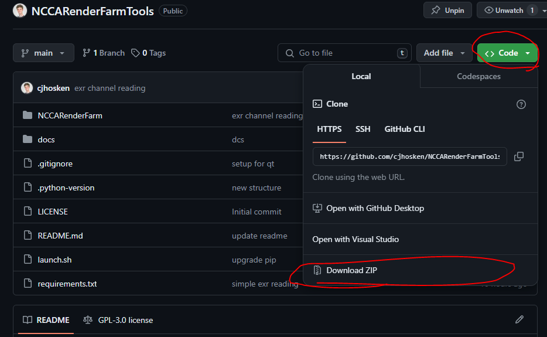

# NCCARenderFarmTools
A standalone application that interacts with the NCCA Renderfarm.

## Installation
Before running the app, you'll need to install it. The first step is downloading the app from GitHub. 

Go to https://github.com/cjhosken/NCCARenderFarmTools, click `Code > Download ZIP`.

Choose a path to store the script, then extract it and dive inside.

### Windows

Installing on windows is a bit tricky. You'll first need to install Git from AppsAnywhere.

Then, navigate over to the NCCARenderFarm folder.

Double click on the setup.sh, this should open up a terminal and begin installing dependencies. Once finished, it will automatically close.

You can double click on `launch.sh`

If double clicking opens the file, you can right click and `Git bash here`.

### Linux

Setup for linux is much simpler. Navigate to the app folder, open a terminal, and run `./setup.sh` to setup the NCCA Renderfarm Tool. This may take a couple minutes, but once done, you'll never have to run setup.sh again.

Then, run `launch.sh` to start the program. You can do so from the terminal or by right clicking and choosing `Open > Run` or `Run in Terminal`

## Contact